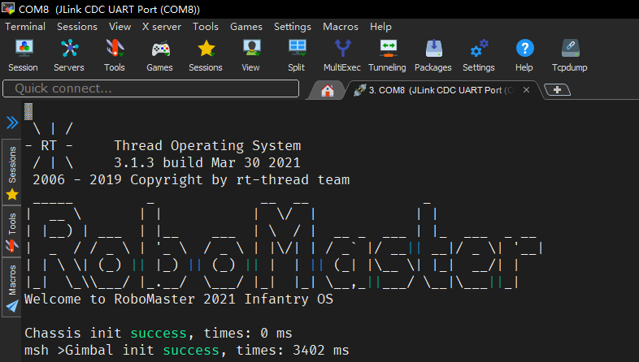
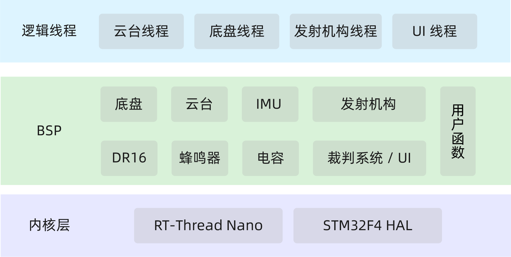
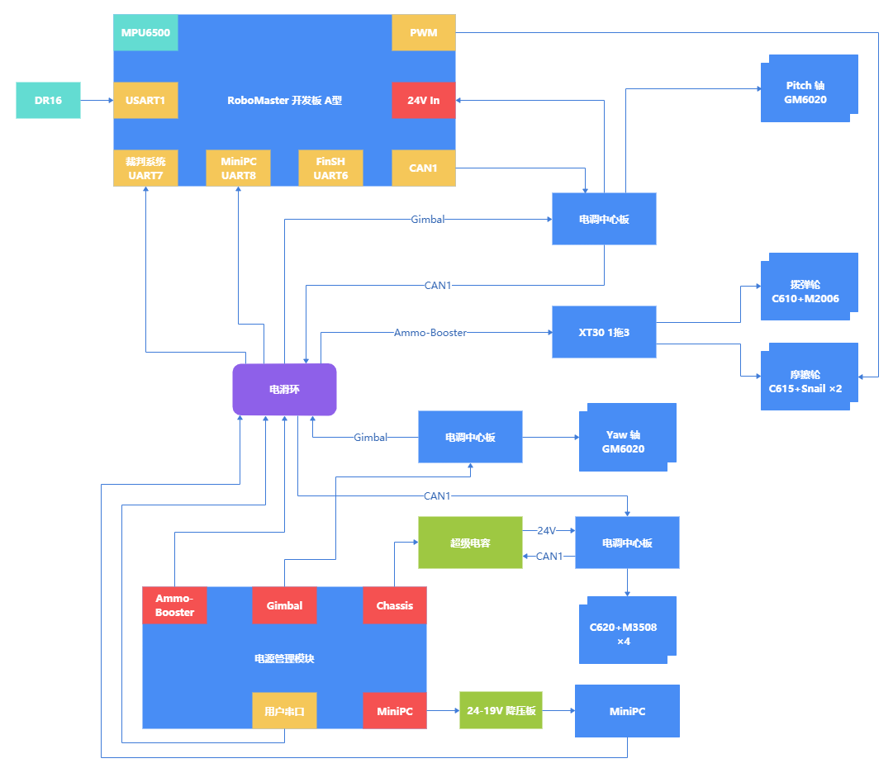

# 风信子 RoboMaster 2021 步兵电控代码



## 开发环境

- STM32CubeMX 6.2.1
- Keil V5.33
- STM32F4xx_DFP V2.15.0
- STM32CubeF4 V1.26.1

## 文件目录结构

```
├───Core
│   ├───Inc                             // 头文件
│   └───Src                             // 源文件
├───Docs                                // 文档
├───Drivers                             // HAL 库与 CMSIS 库
│   ├───CMSIS
│   └───STM32F4xx_HAL_Driver
├───Hardware                            // 外设封装
├───Lib                                 // 常用函数
├───MDK-ARM                             // MDK 工程
├───Middlewares
│   └───Third_Party
│       └───RealThread_RTOS_RT-Thread   // RT-Thread Nano
├───RT-Thread                           // RT-Thread 配置文件
└───Thread                              // 逻辑线程
```

## 系统架构



## 硬件框图



## 系统流程说明

利用 RT-Thread 的 [自动初始化机制](https://www.rt-thread.org/document/site/#/rt-thread-version/rt-thread-standard/programming-manual/basic/basic?id=rt-thread-%e8%87%aa%e5%8a%a8%e5%88%9d%e5%a7%8b%e5%8c%96%e6%9c%ba%e5%88%b6)，对芯片外设进行初始化。然后在 `main` 函数中对逻辑线程初始化。

在每个逻辑线程初始化时，会初始化对应的机构，并启动操作系统提供的定时器进行 **闭环控制**；待云台初始化结束后进入线程循环，使用 **事件集** 进行同步。

由于闭环控制由定时器进行，逻辑线程仅需通过全局变量（如：`chassis_behavior`，`gimbal_behavior`）设置期望值，定时器就会控制对应机构到期望值。从而实现 **逻辑与控制分离**。

## Roadmap

- 利用操作系统，优化线程间消息传递，避免使用全局变量而导致数据竞争
- 优化代码结构

## Licence

Apache License 2.0
